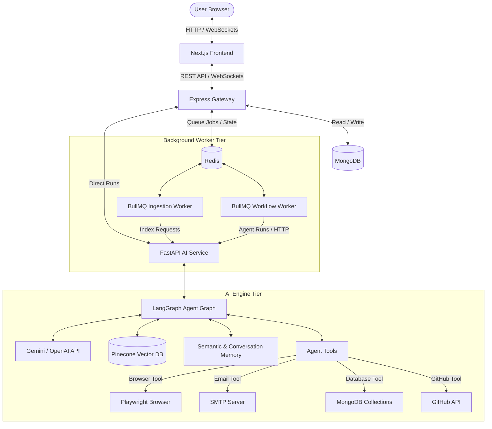

# 🤖 AutoFlow AI Platform

AutoFlow is an enterprise-grade, AI-powered automation platform that orchestrates multi-agent teams using **LangGraph**, processes unstructured documents in the background via a robust **RAG Pipeline**, and executes scheduled visual automation workflows using **BullMQ** and **Redis**.

The platform is designed as a modular, three-tier architecture:
1. **Frontend**: A Next.js web app providing an intuitive workspace, chat interface, workflow builder, and efficiency analytics dashboard.
2. **Backend Gateway**: A Node.js/Express API handling authentication, uploads, workflow orchestration, scheduling, and real-time Socket.IO communication.
3. **AI Services**: A FastAPI microservice driving the multi-agent execution, semantic memory persistence, document ingestion, and vector embeddings database.

---

## 🏗️ System Architecture

The following diagram details the interactions between the Next.js frontend, Express backend, BullMQ workers, FastAPI AI service, and underlying data stores:



---

## ⚡ Key Features

*   **🤖 LangGraph-Powered Multi-Agent Teams**: Build complex agents with customizable system prompts, temperature settings, and model selections (defaulting to `gemini-2.5-flash-lite`).
*   **🔌 Extensible Tool Ecosystem**: Agents have access to built-in tools for web scraping (Playwright), GitHub repository analysis, calculation, email notifications, database inspection, and semantic search.
*   **📂 Background RAG Ingestion**: Handles PDFs, DOCX, Text, and Markdown documents. BullMQ background workers chunk, compute HuggingFace embeddings (`BAAI/bge-small-en`), and store them in Pinecone.
*   **⚙️ Scheduled Workflows**: Define workflows containing sequential AI steps, custom API requests, and execution delays. Automatically triggers tasks on intervals or cron schedules via Redis and BullMQ.
*   **💬 Real-Time Synchronization**: Sockets handle real-time chat updates, document processing status, and workflow completion notifications.
*   **📊 Insights & Analytics**: Real-time monitoring of agent run status, token consumption, and automation efficiencies.

---

## 🛠️ Technology Stack

| Layer | Technologies Used |
| :--- | :--- |
| **Frontend** | React 19, Next.js 15, Tailwind CSS, TypeScript, Socket.io-client, Lucide Icons |
| **Backend Gateway** | Node.js, Express, TypeScript, Mongoose (MongoDB), BullMQ, Redis, Socket.io, Stripe |
| **AI Microservice** | Python, FastAPI, Uvicorn, LangGraph, LangChain, Google GenAI SDK, HuggingFace Transformers, Pinecone |
| **Infrastructure** | Docker, Docker Compose, Nginx (ready), MongoDB 7, Redis 7 (Alpine) |

---

## 🚀 Getting Started

### Prerequisites

Ensure you have the following installed:
*   [Docker](https://www.docker.com/) and Docker Compose
*   [Node.js](https://nodejs.org/) (v18+ if running locally)
*   [Python 3.10+](https://www.python.org/) (if running locally)

---

### 📦 Docker Compose Installation (Recommended)

1.  **Clone and navigate to the project directory**:
    ```bash
    git clone <repository-url> autoflow
    cd autoflow
    ```

2.  **Configure environment variables**:
    Copy the environment variables templates and add your API keys:
    *   Backend: Modify [backend/.env](file:///Users/apple/development/Projects/autoflow/backend/.env) (see variables below).
    *   AI Service: Modify [ai-services/.env](file:///Users/apple/development/Projects/autoflow/ai-services/.env) (add your `GEMINI_API_KEY`, `TAVILY_API_KEY`, and `PINECONE_API_KEY`).

3.  **Spin up the entire application stack**:
    ```bash
    docker compose up --build
    ```
    This command builds and runs:
    *   **Frontend** on [http://localhost:3000](http://localhost:3000)
    *   **Backend Gateway** on [http://localhost:8080](http://localhost:8080)
    *   **AI Service** on [http://localhost:8000](http://localhost:8000)
    *   **MongoDB** database on port `27017`
    *   **Redis** database on port `6379`

---

### 💻 Manual Local Development Setup

If you prefer to run services manually for faster hot-reloading:

#### 1. Databases (Docker)
Start MongoDB and Redis in the background:
```bash
docker run -d -p 27017:27017 --name autoflow-mongo mongo:7
docker run -d -p 6379:6379 --name autoflow-redis redis:7-alpine
```

#### 2. Backend Gateway
Navigate to the [backend/](file:///Users/apple/development/Projects/autoflow/backend) directory, install dependencies, and start the development server:
```bash
cd backend
npm install
npm run dev
```
The server will run on `http://localhost:8080`.

#### 3. AI Services
Navigate to the [ai-services/](file:///Users/apple/development/Projects/autoflow/ai-services) directory, set up a Python virtual environment, install requirements, and run the FastAPI server:
```bash
cd ai-services
python -m venv .venv
source .venv/bin/activate
pip install -r requirements.txt
uvicorn app.main:app --host 127.0.0.1 --port 8000 --reload
```
The AI service API will run on `http://localhost:8000`.

#### 4. Next.js Frontend
Navigate to the [frontend/](file:///Users/apple/development/Projects/autoflow/frontend) directory, install dependencies, and start the development server:
```bash
cd frontend
npm install
npm run dev
```
Open [http://localhost:3000](http://localhost:3000) in your web browser.

---

## ⚙️ Configuration Reference

### Backend Environment Variables (`backend/.env`)

| Variable | Description | Default |
| :--- | :--- | :--- |
| `PORT` | Local port for Express gateway | `8080` |
| `MONGO_URI` | MongoDB connection URI | `mongodb://127.0.0.1:27017/autoflow` |
| `REDIS_URL` | Redis URL for BullMQ | `redis://127.0.0.1:6379` |
| `JWT_SECRET` | Secret key for session tokens | `supersecretkey` |
| `CLIENT_URL` | Frontend client origin URL | `http://localhost:3000` |
| `AI_SERVICE_URL` | FastAPI service URL | `http://localhost:8000` |

### AI Services Environment Variables (`ai-services/.env`)

| Variable | Description | Example / Default |
| :--- | :--- | :--- |
| `GEMINI_API_KEY` | Gemini API key for Google GenAI | `AQ.Ab8...` |
| `TAVILY_API_KEY` | Tavily API key for web search | `tvly-...` |
| `PINECONE_API_KEY` | Pinecone API key for RAG vector storage | `pcsk_...` |
| `PINECONE_INDEX_NAME` | Target index for RAG vector stores | `autoflow` |
| `SMTP_EMAIL` | Sender email address for SMTP | `your-email@gmail.com` |
| `SMTP_PASSWORD` | App-specific password for email | `phtnvecdq...` |
| `CLIENT_URL` | Cross-Origin resource sharing whitelist | `http://localhost:3000` |
| `MONGO_URI` | MongoDB connection URI | `mongodb://127.0.0.1:27017/autoflow` |

---

## 📡 API Reference Summary

### Gateway Router (`backend`)

*   **Authentication** (`/api/auth`):
    *   `POST /register`: Create a new user account.
    *   `POST /login`: Log in to an account and receive a JWT.
    *   `POST /logout`: Destroy the current user session.
*   **Conversations & Chat** (`/api/conversations` & `/api/chat`):
    *   `GET /`: List all conversation history threads.
    *   `POST /`: Create a new conversation thread.
    *   `POST /message`: Send a message to an agent. Supports streaming using Server-Sent Events (SSE).
*   **Agent Management** (`/api/agents`):
    *   `GET /`: Retrieve all active and custom agents.
    *   `POST /`: Define and register a new multi-agent configuration.
*   **Knowledge Base / RAG** (`/api/knowledge`):
    *   `POST /`: Upload documents (`.pdf`, `.docx`, `.txt`, `.md`) for background chunking.
    *   `GET /`: List all uploaded files and their current status (`processing`, `ready`, `failed`).
*   **Workflows** (`/api/workflows`):
    *   `POST /`: Create custom workflow chains.
    *   `POST /:id/trigger`: Run a workflow manually.
*   **Analytics** (`/api/analytics`):
    *   `GET /`: Fetch system usage, agent efficiency, and runtime metrics.

### AI Microservice Router (`ai-services`)

*   **Agent Execution** (`/agents`):
    *   `POST /run`: Execute a LangGraph agent run synchronously and return the full content response.
    *   `POST /stream`: Stream tokens from a LangGraph execution step-by-step using Server-Sent Events (SSE).
*   **Document Ingestion** (`/rag`):
    *   `POST /upload`: Save a file locally and run loader utilities to split text and add elements to Pinecone.
    *   `POST /ask`: Query indexed vector items.

---

## 📂 Repository Structure

Key directories and components:
*   [docker-compose.yml](file:///Users/apple/development/Projects/autoflow/docker-compose.yml): Coordinates container setup.
*   [backend/](file:///Users/apple/development/Projects/autoflow/backend): Express gateway, database schema models, BullMQ queues, and API routes.
    *   [backend/src/server.ts](file:///Users/apple/development/Projects/autoflow/backend/src/server.ts): Backend server bootstrap.
    *   [backend/src/services/queue.service.ts](file:///Users/apple/development/Projects/autoflow/backend/src/services/queue.service.ts): Background BullMQ ingestion and workflow job execution.
*   [ai-services/](file:///Users/apple/development/Projects/autoflow/ai-services): FastAPI microservice, Python RAG modules, and LangGraph multi-agent configurations.
    *   [ai-services/app/main.py](file:///Users/apple/development/Projects/autoflow/ai-services/app/main.py): FastAPI app registry.
    *   [ai-services/app/agents/orchestrator/langgraph_agent.py](file:///Users/apple/development/Projects/autoflow/ai-services/app/agents/orchestrator/langgraph_agent.py): LangGraph state graph declaration.
*   [frontend/](file:///Users/apple/development/Projects/autoflow/frontend): Next.js app directory with the chat interface, workspace management, and analytics charts.
